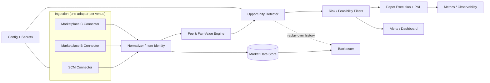

# CS2 Skin Arbitrage Bot — System Design

> A high-level blueprint. It tells you **what** each part does and **why**, plus the order to build it in. It deliberately contains **no implementation code** — the interfaces are contracts for *you* to fill in in Python. That is the whole point: you learn by writing the bodies yourself.

---

## 1. What this is (and isn't)

**Goal:** detect price discrepancies for the same CS2 skin across marketplaces, decide whether a discrepancy is a *real* opportunity after fees, frictions and risk, and track how those opportunities would have performed.

**In scope**
- Pulling live prices/quotes from multiple venues.
- Recognising "the same item" across venues.
- Computing net edge after fees and modelling the risk that eats a naive "arb".
- **Paper trading** (simulated fills) + P&L + a backtester over stored history.
- Alerts + a small dashboard.

**Deliberately out of scope (for now)**
- No automated real-money execution, no bypassing anti-bot measures, no scraping that violates a venue's Terms of Service. Use official/public APIs, respect rate limits. This isn't timidity — for an HFT interview, *showing you understand why an "arbitrage" is not free money* (fees, trade holds, latency, liquidity, ToS) is worth more than a bot that clicks buy.

Treat "arbitrage" here as **relative-value detection + execution simulation**, not a money printer.

---

## 2. Why this project earns its place (HFT framing)

Every component below maps to something IMC / Optiver / Jane Street actually care about. Keep this mapping in your README — it's your interview story.

| Bot concept | HFT concept it teaches |
|---|---|
| Bid/ask per venue, spread, mid | Market microstructure |
| Net edge after fees | Taker/maker fees, transaction cost analysis |
| Quote staleness, latency per connector | Latency & why speed = money |
| Liquidity / volume filter | Market impact, slippage |
| Trade-hold / lock time as risk | Inventory & holding risk |
| Backtesting without look-ahead | Research integrity, the #1 quant sin |
| Paper P&L accounting | Position & P&L bookkeeping |
| Ports-and-adapters, async, tests | Clean systems engineering under load |

---

## 3. Architecture



The shape is **ports & adapters (hexagonal)**: the core logic (pricing, detection, risk) knows nothing about *which* venue or *how* you fetch — it only sees normalized quotes. That's what lets you add a fourth marketplace without touching the detector, and it's exactly the modularity interviewers probe for.

---

## 4. Components

For each: **responsibility**, a **contract** (what to implement — signatures only), and **what you learn**.

### 4.1 Venue Connectors (the adapters)
One class per marketplace (Steam Community Market + 2–3 third-party venues). Each knows how to authenticate, page through listings, respect that venue's rate limit, retry on failure, and return quotes in **one shared shape**.

```text
Protocol VenueConnector:
    name: str
    def fetch_quotes(items: list[ItemRef]) -> list[Quote]
    # internally: auth, pagination, rate-limit, retry/backoff
```

Learn: HTTP APIs, rate limiting, exponential backoff, the adapter pattern, defensive parsing.

### 4.2 Normalizer / Item Identity
The same skin is described differently everywhere (name, wear/float, StatTrak, souvenir). Map each raw listing to a **canonical item id** so quotes are comparable.

```text
def canonical_id(raw_item) -> str
@dataclass Quote: item_id, venue, bid, ask, volume, ts
```

Learn: data modelling, entity resolution, why "join keys" are hard in the real world.

### 4.3 Market Data Store
Persist quote snapshots as a time series (start with SQLite or Parquet files; schema you can query by item + venue + time). Powers the backtester and any analytics.

Learn: schema design, time-series storage, idempotent writes.

### 4.4 Fee & Fair-Value Engine
Turn raw prices into **what you'd actually net**. Steam takes ~15%; third-party venues have their own maker/taker fees and withdrawal frictions. Produce effective net-buy and net-sell per venue, plus mid and spread.

```text
def net_buy(venue, price) -> float
def net_sell(venue, price) -> float
```

Learn: fee modelling, transaction cost analysis — the difference between gross and net is where most "arbs" die.

### 4.5 Opportunity Detector (the core)
For an item, compare **net-sell on venue B** against **net-buy on venue A**. If the edge clears a threshold, emit an `Opportunity`. Keep this pure and testable — it takes quotes in, returns opportunities out, no I/O.

```text
@dataclass Opportunity: item_id, buy_venue, sell_venue, buy_px, sell_px, gross_edge, net_edge, ts
def detect(quotes_by_venue) -> list[Opportunity]
```

Learn: the actual relative-value logic, thresholds, keeping core logic side-effect-free (this is what makes it backtestable).

### 4.6 Risk / Feasibility Filters
A positive net edge is necessary, not sufficient. Kill opportunities that are illiquid (thin volume), stale (quotes too old), locked (Steam trade holds mean price risk while you wait), too volatile, or over your capital/inventory limits.

```text
def passes(opp, market_state) -> bool  # composできる filters
```

Learn: risk management, and the honest reason arbitrage isn't free — holding risk, latency, liquidity.

### 4.7 Paper Execution + P&L
Simulate fills for surviving opportunities: apply slippage, record positions, accrue fees, mark P&L over time. No real orders. Later you can add an "alert-and-confirm" manual mode.

```text
class PaperBroker:
    def submit(opp) -> Fill
    positions, realized_pnl, unrealized_pnl
```

Learn: order/fill modelling, P&L accounting, the bookkeeping discipline every trading system needs.

### 4.8 Backtester / Replay
Run the detector + risk filters over the **stored** history and report metrics: opportunities/day, hit rate, simulated P&L, distribution of edges. Guard hard against **look-ahead bias** (never use a price the strategy couldn't have seen yet).

```text
def run(store, detector, risk, broker) -> Metrics
```

Learn: backtesting rigor, look-ahead/survivorship bias — the single most valued quant instinct.

### 4.9 Orchestration / Scheduler
The loop that ties it together: poll connectors on intervals, run detection, push to risk → paper broker → alerts. Start synchronous; move to `asyncio` once you feel the latency of serial polling.

Learn: event loops, scheduling, async I/O, concurrency.

### 4.10 Alerts + Dashboard
Emit surviving opportunities and running P&L somewhere you'll actually look: console first, then a Discord/Telegram webhook, then a tiny web dashboard.

Learn: observability, presenting results (matters for the portfolio).

### 4.11 Config, Secrets, Metrics (cross-cutting)
Config-driven venues/thresholds (a YAML/TOML file, not hard-coded). Secrets out of the repo. Log latency per connector, opportunities/hour, filter pass-rates.

Learn: ops hygiene, structured logging, metrics — HFT lives on latency dashboards.

---

## 5. Core data model (define these first)

```text
ItemRef      : the thing you want quotes for (weapon, skin, wear, stattrak?)
Quote        : item_id, venue, bid, ask, volume, ts
Opportunity  : item_id, buy_venue, sell_venue, buy_px, sell_px, gross_edge, net_edge, ts
Fill         : opp, filled_px, fee, ts
Metrics      : counts, hit_rate, pnl_curve, edge_distribution
```

Get these dataclasses right and the rest of the system is "just" functions between them.

---

## 6. Build order (start here, one commit per milestone)

Each milestone is runnable and demoable — that's how you keep momentum and produce a clean git history recruiters can read.

- **M0 — Skeleton + one connector (read-only).** Project layout, config, one venue, print normalized `Quote`s. *You can start this tonight.*
- **M1 — Second venue + item identity.** Compare one specific skin across two venues.
- **M2 — Fees + detector.** Emit `Opportunity` objects with net edge for that pair.
- **M3 — Storage + risk filters.** Persist snapshots; add liquidity + staleness filters.
- **M4 — Backtester + metrics.** Replay history, report hit rate and simulated P&L. (Look-ahead guard here.)
- **M5 — Paper broker + P&L + alerts.** Simulated fills, P&L curve, Discord/console alerts.
- **M6 — Scale + polish.** N venues/items, async orchestration, unit tests, CI, README with the HFT mapping from §2.

Rule of thumb: **don't build M2 until M1 runs.** Depth over breadth — one venue done well beats five half-wired.

---

## 7. Concepts to learn as you go (checklist)

- [ ] Market microstructure: bid, ask, spread, mid, depth, slippage
- [ ] Maker vs taker fees; effective vs quoted price
- [ ] Rate limiting, backoff, idempotency
- [ ] Time-series storage & querying
- [ ] Look-ahead & survivorship bias in backtests
- [ ] Position/P&L accounting (realized vs unrealized)
- [ ] `asyncio` and concurrent I/O
- [ ] Ports & adapters architecture; dependency inversion
- [ ] `pytest`, property tests for the detector, CI
- [ ] Structured logging + latency metrics

---

## 8. Guardrails (keep it clean and defensible)

- Use official/public APIs; read each venue's ToS; honour rate limits.
- No real automated execution, no anti-bot evasion. Detection + paper trading only.
- Keep secrets out of git. Don't publish other people's data.
- If a venue forbids programmatic access, drop it — a smaller legal system beats a bigger grey one, and it's a better interview answer.

---

## 9. Stretch (ties to your C++/HFT roadmap)

Once the Python version works end-to-end:
- Rewrite the **hot path** (detector + fee math) in **C++** and benchmark Python vs C++ latency — a concrete, quantified story for IMC/Optiver.
- Add a latency budget per stage and a metric for "detection age" (how stale was the quote when you flagged it).
- Model market impact: what happens to your edge if you scale size?

---

*Design doc — build the bodies yourself. When a milestone runs, commit it and note in the README which HFT concept it demonstrates.*
